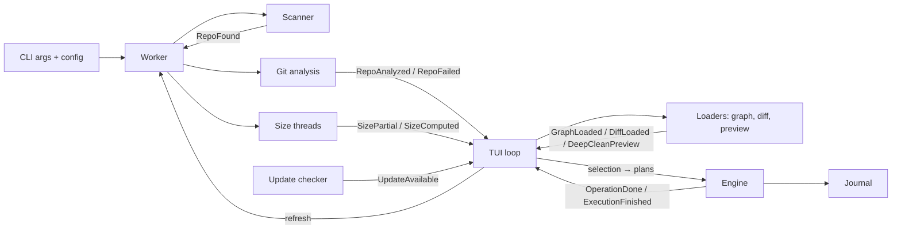

# Sloth — Architecture Documentation

## Overview

Sloth is a terminal-based Git repository manager built in Rust. It scans a directory tree for Git repositories, analyzes their branches, stashes and worktrees, measures disk usage, and lets the user queue cleanup operations across any number of repositories, review them, run them from the TUI and undo them.

It can also run without the TUI: `sloth clean` (headless cleanup) and `sloth restore` (undo).

## High-Level Data Flow



1. **Worker** (`worker.rs`) starts the **scanner** and analyzes each repository **as soon as it is discovered**, with concurrency bounded by the number of CPUs. Results are streamed as `RepoAnalyzed` (or `RepoFailed`) events in completion order.
2. After each analysis, the repository is queued for **size measurement** by 4 threads: `.git`, the paths a deep clean would remove (`SizePartial` while measuring) and linked worktrees (`SizeComputed`). Reclaimable paths come from `git ls-files --others [--ignored] --directory`, which does not descend into ignored folders (`git clean -n` does, and can take minutes on a `node_modules` with a junction back to the repository).
3. The **TUI loop** (`ui.rs`) applies events to `AppState`, starts **loaders** for what the current view needs (graph, diff, deep-clean preview) on worker threads, and redraws only when an input or a background event changed something, or while a spinner is visible.
4. The user builds a **selection** (`ui/selection.rs`) — the cleanup queue — from any tab and repository. Confirming turns it into **plans** (one per repository) that the **engine** runs in the background, reporting each operation as `OperationDone`.
5. Successful deletions of branches and stashes are appended to the **journal**. When the run finishes, cleaned items leave the queue and the affected repositories are **refreshed** through the worker.

## Module Breakdown

### `main.rs` — Entry Point

- Parses CLI arguments with `clap`: `sloth [--path]`, `sloth clean …`, `sloth restore …`
- Loads the configuration, resolves the directory to scan
- For the TUI: creates the event channel, starts the worker and the update check, builds `AppState` (with the journal) and hands over to `ui::run_tui`

### `config.rs` — Configuration

- `Config` is deserialized from TOML (`$SLOTH_CONFIG` or `<config dir>/sloth/config.toml`); unknown keys are rejected so typos are reported
- A commented template is written on first run; the v0.1 `~/.sloth_theme` file is migrated
- The theme is saved with `toml_edit`, preserving the user's comments
- `glob_match` implements the `*`/`?` patterns of `protected_branches`

### `sys.rs` — System Abstraction Layer

| Trait | Methods | Purpose |
|---|---|---|
| `GitExecutor` | `run_git_command()`, `run_git_command_async()`, `run_git_command_with_input()` | All Git CLI interactions |
| `FileSystem` | `get_size()`, `is_repository()` | Disk usage (never follows symlinks or junctions), nested repository detection |

- `RealSystem` runs `git` with `LC_ALL=C` (output is parsed), no terminal prompts and no pager
- `MockSystem` (`#[cfg(test)]`) maps `(path, args[, stdin])` to canned outputs

### `scanner.rs` — Discovery

- `ignore::WalkBuilder` in parallel, respecting `.gitignore`, skipping `scan_exclude` directory names
- Streams the parent of every `.git` directory through a `tokio::sync::mpsc` channel

### `git/` — Git Domain

| File | Responsibility |
|---|---|
| `models.rs` | `RepoStatus`, `BranchInfo`, `StashInfo`, `WorktreeInfo` — pure data, plus `has_unique_commits()` |
| `analyze.rs` | `analyze_repository`: default branch (`origin/HEAD`, then well-known names), branches via **one** `git for-each-ref` (sha, upstream tracking, date, worktree) and **one** `%(ahead-behind:<default>)` call (git ≥ 2.41, per-branch `rev-list` fallback), stashes, worktrees (main, dirty, locked, prunable), remote URL |
| `squash.rs` | Detects rebase-merged (`git cherry`) and squash-merged (patch-id of the whole branch found on the default branch) branches, only for unmerged branches without a live upstream |
| `commands.rs` | Graph (`--all`, capped to 2000 commits) and diff commands |
| `stats.rs` | `rev-list` fallback, `--shortstat` parsing, size and age formatting |

**Design decisions:**
- Git data comes from the `git` CLI for fidelity with the user's Git; the first `for-each-ref` also checks the directory is a usable repository
- A branch is "merged" when it has no commit ahead of the default branch, which also covers branches checked out in linked worktrees
- Diff stats are only computed for branches that are ahead

### `cleanup.rs` — Cleanup Rules

- `branch_protection` / `worktree_protection`: default branch, checked-out branches, `protected_branches`, main worktree
- `is_smart_candidate`: unprotected and (merged or gone); `is_stale`
- `cleanup_operations`: turns selected items into engine operations, dropping protected or unknown ones; worktrees are removed before their branch so the branch becomes deletable
- `operation_warning`: unmerged/unpushed commits, uncommitted changes in a worktree

### `engine.rs` — Execution Engine

- `execute(plans, dry_run, sys, observer)` runs repositories concurrently (at most 8 at a time) and the operations of a repository in order; results come back in plan order and each one is passed to the observer as it completes
- Operations: `DeleteBranch` (only if the branch still points to the analyzed commit), `DropStash` (matched by commit id), `RemoveWorktree` (`--force` only for dirty worktrees, `worktree prune` for missing ones), `PruneRemotes`, `GarbageCollect` (reports the `.git` space freed), `DeepClean` (`git clean -xd -f`: a single `-f` spares nested repositories; `-e` keeps `deep_clean_keep`)

### `journal.rs` — Undo

- JSON lines at `$SLOTH_JOURNAL` or `<data dir>/sloth/journal.jsonl`: batch, date, repository, kind, name, sha
- `Journal::observer` records successful branch deletions and stash drops during a run
- `restore` recreates a branch (renamed if its name was reused) or `git stash store`s a stash, after checking the commit still exists

### `worker.rs` — Background Pipeline

- `Worker::scan` (discovery + analysis), `Worker::refresh` (re-analysis of given repositories), and the size threads
- Everything is reported through `ScannerEvent`s on a `std::sync::mpsc` channel, consumed by the synchronous TUI loop

### `cli/` — Headless Commands

- `clean.rs`: scans, analyzes, builds plans from `--merged` / `--gone` / `--stale` / `--branch`, prints them, asks for confirmation (refuses without a terminal unless `--yes`), runs them with the journal
- `restore.rs`: lists journal entries or restores them (`--last` for the last run)

### `ui.rs` — TUI Loop

- Terminal setup/teardown (raw mode, alternate screen, mouse capture) and a panic hook that restores the terminal
- `apply_event`, `request_loads`, `start_execution`, `refresh`
- `draw`: header, tab bar, the current tab, status bar, then overlays (diff, confirmation, execution results, help)

### `ui/` — State, Views and Input

| File | Responsibility |
|---|---|
| `state.rs` | `AppState` (repositories, tab, focus, cursors, filters, sorts, selection, overlays, toasts, execution, layout cache), `ScannerEvent`, `Totals` |
| `selection.rs` | The cleanup queue, keyed by repository path; builds plans, forgets cleaned items, drops vanished ones |
| `views.rs` | The rows each table shows (filtering and sorting), shared by rendering and input so the cursor always matches the screen |
| `events.rs` | Keyboard and mouse handling, by overlay, then global keys, then tab and pane |
| `keymap.rs` | Bindings shown in the status bar and the `?` overlay |
| `loader.rs` | Graph, diff and deep-clean preview on worker threads |
| `theme.rs` | Color palettes |

The repository cursor follows the repository **path**, so sorting, filtering, new discoveries and refreshes never move it to another repository.

### `ui/components/` — Render Functions

| Component | Content |
|---|---|
| `header.rs` | One line: scanned directory, totals, progress, update notice, theme |
| `tabs.rs` | Tab bar (records click zones) |
| `repositories.rs` | Repos tab: repository table |
| `details.rs` | Repos tab: branches, stashes and worktrees of the focused repository |
| `graph.rs` | Repos tab: ANSI-colored commit graph |
| `branches.rs` | Branches tab: branches of every repository |
| `queue.rs` | Queue tab: operations the queue will run, with warnings |
| `dashboard.rs` | Totals and repositories with the most to clean |
| `diff_modal.rs`, `confirm_modal.rs`, `execution_modal.rs` | Overlays |
| `help.rs` | Status bar and key reference overlay |

## Concurrency Model

```
Main thread (TUI loop)            Tokio runtime / threads
    │                                   │
    │  Worker::scan ──────────────────► │── scanner (spawn_blocking, parallel walk)
    │                                   │── analysis per repository (spawn_blocking, ≤ CPUs)
    │ ◄──── RepoFound / RepoAnalyzed ── │
    │                                   │── size threads (4)
    │ ◄──── SizePartial / SizeComputed ─│
    │  loaders ───────────────────────► │── graph / diff / preview threads
    │ ◄──── GraphLoaded / DiffLoaded ── │
    │  start_execution ───────────────► │── engine (tokio tasks, ≤ 8 repositories)
    │ ◄──── OperationDone / Finished ── │── journal (observer)
    │  Worker::refresh ───────────────► │── re-analysis
```

- The TUI owns the terminal on the main thread and never blocks on git
- Background work reports through a `std::sync::mpsc` channel since the consumer is synchronous
- The loop waits for input with an 80 ms timeout while something animates, 250 ms otherwise

## Error Handling

| Layer | Strategy |
|---|---|
| Scanner | Unreadable directories are skipped |
| Analysis | A failed repository is shown with its error instead of spinning forever |
| Engine | Every operation reports its own success or error; the others continue |
| Config | Invalid files fall back to defaults with a warning |
| TUI | Terminal restored on exit, error and panic |
| Updater | Best effort, failures ignored |

## Testing Strategy

- **Hermetic unit tests** with `MockSystem`: parsers, analysis, squash detection logic, protection rules, plans, engine, selection, views, config
- **Real-git tests** (`test_support::TempRepo`): squash detection, deep clean safety, restore, and an end-to-end TUI flow (real worker → state → render → queue → run → refresh)
- **Snapshot tests** (`insta`): every tab and overlay rendered into a `TestBackend`
- **CI** runs fmt, clippy (`-D warnings`), tests on Linux/macOS/Windows, coverage and release builds
