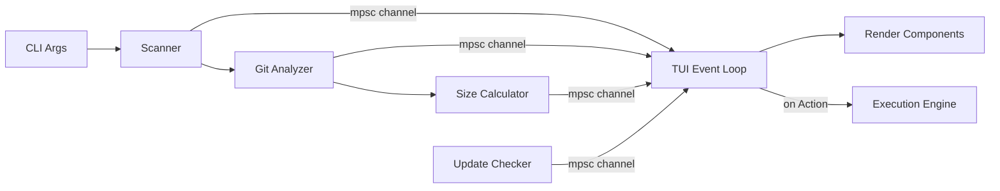

# Sloth — Architecture Documentation

## Overview

Sloth is a terminal-based Git repository manager built in Rust. It scans a directory tree for Git repositories, analyzes their branch, stash and worktree state, computes disk usage, and presents an interactive multi-pane TUI for exploration and cleanup.

## High-Level Data Flow



1. **Scanner** walks the filesystem asynchronously, emitting `RepoFound` events.
2. **Git Analyzer** runs `git` commands on each discovered repo via `GitExecutor`, emitting `RepoAnalyzed` events.
3. **Size Calculator** runs sequentially in the background, emitting `SizePartial` events as each file/directory is measured (so the UI shows a live growing estimate) and a final `SizeComputed` event when complete.
4. **Update Checker** queries GitHub releases API in the background, emitting `UpdateAvailable` if a newer version exists.
5. **TUI Event Loop** consumes events, updates `AppState`, and re-renders every 16ms.
6. **Execution Engine** performs destructive operations when the user confirms (branch delete, stash drop, worktree remove, prune, gc, deep clean).

## Module Breakdown

### `main.rs` — Entry Point

- Parses CLI arguments via `clap`
- Creates an `mpsc::channel` for background → UI communication
- Spawns Tokio tasks for scanning, analysis, background sizes, and update checking
- Hands the receiver to `ui::run_tui`
- After TUI exits, executes the selected action via `engine::execute_batch` and reports disk space recovered

### `sys.rs` — System Abstraction Layer

Defines two traits for dependency injection:

| Trait | Methods | Purpose |
|---|---|---|
| `GitExecutor` | `run_git_command()`, `run_git_command_async()`, `open_repo()` | Abstract all Git CLI interactions |
| `FileSystem` | `exists()`, `get_size()` | Abstract all filesystem queries (`get_size` walks directories recursively) |

**Implementations:**
- `RealSystem` — wraps `std::process::Command`, `tokio::process::Command`, `std::fs`, and `gix::open`
- `MockSystem` (`#[cfg(test)]`) — in-memory HashMap-based fake for deterministic hermetic tests

### `scanner.rs` — Filesystem Discovery

- Uses the `ignore` crate's `WalkBuilder` for fast, `.gitignore`-respecting traversal
- Returns a `tokio::sync::mpsc::Receiver` that yields discovered `.git` directory paths
- Runs on a dedicated threadpool via Rayon

### `git/` — Git Domain

| File | Responsibility |
|---|---|
| `models.rs` | `RepoStatus`, `BranchInfo`, `StashInfo`, `WorktreeInfo`, `GitError` — pure data |
| `commands.rs` | `analyze_repository`, `get_git_graph`, `get_branch_diff`, `get_stash_diff` — all accept `&impl GitExecutor` |
| `stats.rs` | `get_branch_stats` (ahead/behind/diff via `GitExecutor`), `get_repo_size` (via `FileSystem`), `parse_shortstat`, `format_size` |
| `mod.rs` | Re-exports public API |

**Key design decisions:**
- Uses `gix` only to validate/open repos; actual data comes from `git` CLI for reliability
- `parse_shortstat` is a pure function with full test coverage
- Graph and diff data are fetched lazily (on-demand) to avoid upfront cost
- Size calculations are inlined in `main.rs` and stream `SizePartial` events per file so the UI shows a live growing estimate rather than a blank then a jump

### `ui.rs` — TUI Runner

- Sets up the terminal with `crossterm` (raw mode, alternate screen)
- Runs the main 60fps render loop
- Lazily fetches graph lines and diff content on pane focus
- Delegates rendering to `components::*` and input to `events::handle_events`
- Returns the user's selection (paths, action, branches, stashes, worktrees) on exit

### `ui/state.rs` — Application State

- `AppState` — single struct holding all mutable TUI state (repo list, selections, focus, scroll offsets, loading flags)
- `Focus` enum — tracks which pane has keyboard focus
- `ScannerEvent` enum — messages from background tasks: `RepoFound`, `RepoAnalyzed`, `ScanComplete`, `AnalysisComplete`, `SizePartial` (live running estimate), `SizeComputed` (final), `UpdateAvailable`
- `UiAction` enum — `CleanRepo`, `PruneRemotes`, `GarbageCollect`, `DeepClean`

### `ui/events.rs` — Input Handler

- `handle_events(state)` — polls `crossterm` and mutates `AppState`
- Pure state machine: no rendering, no I/O beyond keyboard polling
- Handles navigation, selection toggling, action menu, graph controls, diff modal, theme cycling, dashboard toggle, and quit

### `ui/theme.rs` — Theme Engine

- Defines multiple color palettes (e.g., dark, light, ocean) as named themes
- Persists user preference to a config file
- Exposes theme colors to all rendering components

### `ui/components/` — Render Functions

Each component is a pure `render(frame, state, area)` function:

| Component | Pane | Content |
|---|---|---|
| `header.rs` | Top | App title, repository count, current theme, update banner |
| `repositories.rs` | Left | Repo list with disk size indicators and selection state |
| `details.rs` | Center | Branch/stash/worktree list with selection checkboxes, ahead/behind stats, diff stats, merge status |
| `graph.rs` | Right | ANSI-colored commit graph with Unicode box-drawing, fullscreen toggle |
| `dashboard.rs` | Overlay | Aggregated stats overview across all scanned repositories |
| `diff_modal.rs` | Overlay | Floating modal showing syntax-colored branch or stash diffs with scroll position |
| `confirm_modal.rs` | Overlay | Pre-execution confirmation prompt; shows action detail and deep-clean file preview |
| `help.rs` | Bottom | Context-sensitive keyboard shortcut bar |

### `engine.rs` — Execution Engine

- `execute_batch<T: GitExecutor>` — runs actions across repos concurrently via `tokio::spawn`
- Uses `run_git_command_async` for non-blocking Git operations
- Supports dry-run mode for safe previews
- Stashes are dropped in reverse index order to prevent index shift bugs

**Supported actions:**
| Action | Git command |
|---|---|
| `CleanRepo` | `branch -D`, `stash drop`, `worktree remove --force` |
| `PruneRemotes` | `remote prune origin` (with safety check for origin existence) |
| `GarbageCollect` | `gc` |
| `DeepClean` | `clean -xdff --exclude=.git` |

### `updater.rs` — Self-Update

- Queries `https://api.github.com/repos/.../releases/latest` for the newest version
- Compares with compiled-in `CARGO_PKG_VERSION`
- Emits `ScannerEvent::UpdateAvailable` if a newer release exists

## Concurrency Model

```
Main Thread          Tokio Runtime
    │                     │
    │  spawn ──────────►  │─── Scanner Task
    │                     │      │
    │                     │      ├─ RepoFound ──► mpsc ──► TUI
    │                     │      └─ ScanComplete ──► mpsc ──► TUI
    │                     │
    │                     │─── Analyzer Tasks (spawn_blocking × N)
    │                     │      │
    │                     │      ├─ RepoAnalyzed ──► mpsc ──► TUI
    │                     │      └─ AnalysisComplete ──► mpsc ──► TUI
    │                     │
    │                     │─── Size Calculator (spawn_blocking, sequential)
    │                     │      ├─ SizePartial ──► mpsc ──► TUI  (per file, live)
    │                     │      └─ SizeComputed ──► mpsc ──► TUI (final)
    │                     │
    │                     │─── Update Checker (spawn_blocking)
    │                     │      └─ UpdateAvailable ──► mpsc ──► TUI
    │                     │
    │◄── run_tui ─────────│
    │  (blocking on main) │
    │                     │
    │── execute_batch ──► │─── Engine Tasks (spawn × N, async GitExecutor)
```

- The TUI runs on the main thread (required by terminal I/O)
- Background work happens on Tokio's thread pool
- Communication is via `std::sync::mpsc` (not `tokio::sync`) since the consumer is synchronous
- Size calculations run sequentially to avoid I/O thrashing on large worktrees

## Error Handling

| Layer | Strategy |
|---|---|
| Scanner | Silently skips non-repo directories |
| Git commands | Returns `Result<T, GitError>` or `io::Result`, errors are logged per-repo |
| Engine | Returns `ExecutionResult` with `success` flag and message |
| TUI | Uses `io::Result`, cleans up terminal on any error |
| Updater | Best-effort, failures are silently ignored |

## Testing Strategy

- **Hermetic unit tests** via `MockSystem` — no real Git repos or disk access needed
- **`git::commands`** — `analyze_repository` against mocked Git outputs and virtual filesystems
- **`git::stats`** — `parse_shortstat` edge cases (empty, partial, malformed, insertions-only, deletions-only)
- **`engine`** — `execute_batch` for CleanRepo and PruneRemotes with mocked async commands
- **`ui::state`** — `AppState` initialization invariants
- **CI pipeline** runs fmt + clippy + test + build on every push
