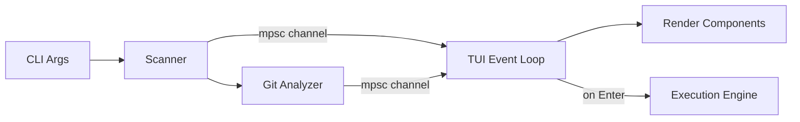

# Sloth — Architecture Documentation

## Overview

Sloth is a terminal-based Git repository manager built in Rust. It scans a directory tree for Git repositories, analyzes their branch and stash state, and presents an interactive TUI for exploration and cleanup.

## High-Level Data Flow



1. **Scanner** walks the filesystem asynchronously, emitting `RepoFound` events.
2. **Git Analyzer** runs `git` commands on each discovered repo, emitting `RepoAnalyzed` events.
3. **TUI Event Loop** consumes events, updates `AppState`, and re-renders every 16ms.
4. **Execution Engine** performs destructive operations (branch delete, stash drop) when the user confirms.

## Module Breakdown

### `main.rs` — Entry Point

- Parses CLI arguments via `clap`
- Creates an `mpsc::channel` for background → UI communication
- Spawns a Tokio task that runs the scanner and analyzer pipeline
- Hands the receiver to `ui::run_tui`

### `scanner.rs` — Filesystem Discovery

- Uses the `ignore` crate's `WalkBuilder` for fast, `.gitignore`-respecting traversal
- Returns a `tokio::sync::mpsc::Receiver` that yields discovered `.git` directory paths
- Runs on a dedicated threadpool via Rayon

### `git/` — Git Domain

| File | Responsibility |
|---|---|
| `models.rs` | `RepoStatus`, `BranchInfo`, `StashInfo`, `GitError` — pure data |
| `commands.rs` | Shells out to `git` for branch listing, stash listing, graph log, diff stats |
| `mod.rs` | Re-exports public API (`analyze_repository`, `get_git_graph`, `RepoStatus`) |

**Key design decisions:**
- Uses `gix` only to validate/open repos; actual data comes from `git` CLI for reliability
- `parse_shortstat` is a pure function with full test coverage
- Graph data is fetched lazily (on-demand) to avoid upfront cost

### `ui.rs` — TUI Runner

- Sets up the terminal with `crossterm` (raw mode, alternate screen)
- Runs the main 60fps render loop
- Delegates rendering to `components::*` and input to `events::handle_events`
- Returns the user's selection (path, branches, stashes) on exit

### `ui/state.rs` — Application State

- `AppState` — single struct holding all mutable TUI state
- `Focus` enum — tracks which pane has keyboard focus
- `ScannerEvent` enum — messages from background tasks to the UI
- Has unit tests validating initialization defaults

### `ui/events.rs` — Input Handler

- `handle_events(state)` — polls `crossterm` and mutates `AppState`
- Pure state machine: no rendering, no I/O beyond keyboard polling
- Handles navigation, selection toggling, graph controls, quit

### `ui/components/` — Render Functions

Each component is a pure `render(frame, state, area)` function:

| Component | Pane | Content |
|---|---|---|
| `repositories.rs` | Left | Repo list with scanning loader |
| `details.rs` | Middle | Branch/stash list with selection checkboxes, ahead/behind stats |
| `graph.rs` | Right | ANSI-colored commit graph with Unicode box-drawing characters |

### `engine.rs` — Execution Engine

- `execute_batch` — runs actions across repos concurrently via `tokio::spawn`
- Supports dry-run mode for safe previews
- Stashes are dropped in reverse index order to prevent index shift bugs

## Concurrency Model

```
Main Thread          Tokio Runtime
    │                     │
    │  spawn ──────────►  │─── Scanner Task
    │                     │      │
    │                     │      ├─ RepoFound ──► mpsc ──► TUI
    │                     │      └─ ScanComplete ──► mpsc ──► TUI
    │                     │
    │                     │─── Analyzer Tasks (spawn_blocking × N)
    │                     │      │
    │                     │      ├─ RepoAnalyzed ──► mpsc ──► TUI
    │                     │      └─ AnalysisComplete ──► mpsc ──► TUI
    │                     │
    │◄── run_tui ─────────│
    │  (blocking on main) │
```

- The TUI runs on the main thread (required by terminal I/O)
- Background work happens on Tokio's thread pool
- Communication is via `std::sync::mpsc` (not `tokio::sync`) since the consumer is synchronous

## Error Handling

| Layer | Strategy |
|---|---|
| Scanner | Silently skips non-repo directories |
| Git commands | Returns `Result<T, GitError>`, errors are logged per-repo |
| Engine | Returns `ExecutionResult` with `success` flag and message |
| TUI | Uses `io::Result`, cleans up terminal on any error |

## Testing Strategy

- **Unit tests** in `git/commands.rs` for parsing functions
- **State tests** in `ui/state.rs` for initialization invariants
- **Snapshot tests** via `insta` for `RepoStatus` structures
- **CI pipeline** runs fmt + clippy + test + build on every push
